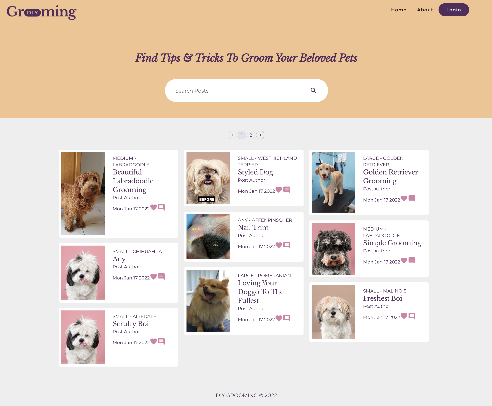
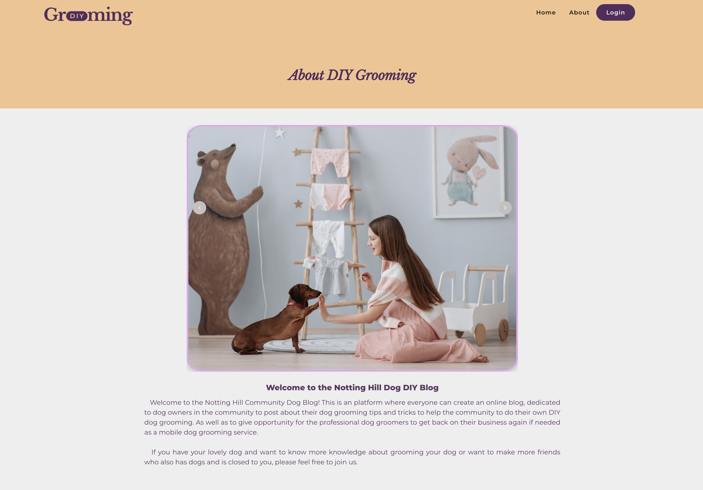
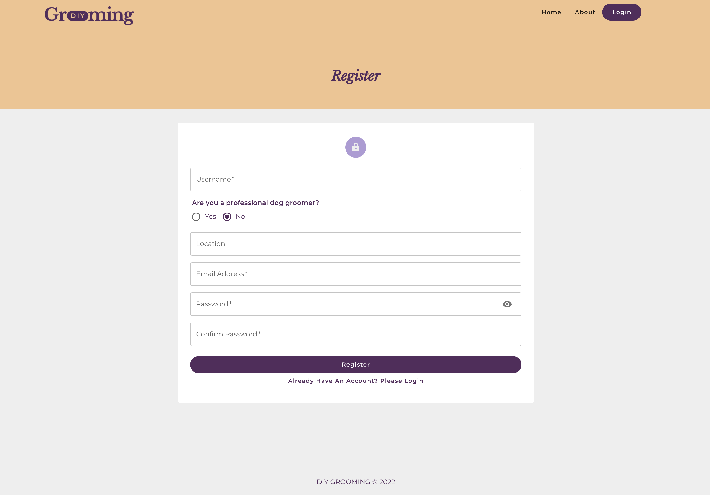
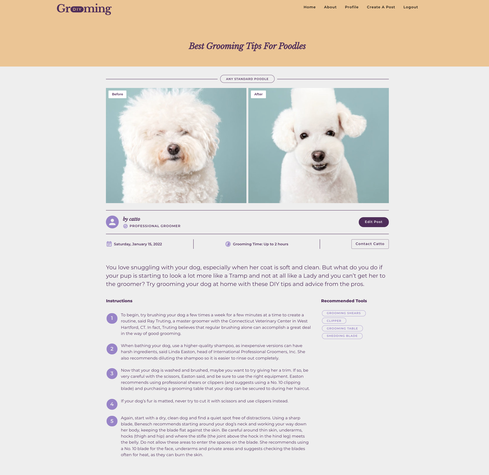
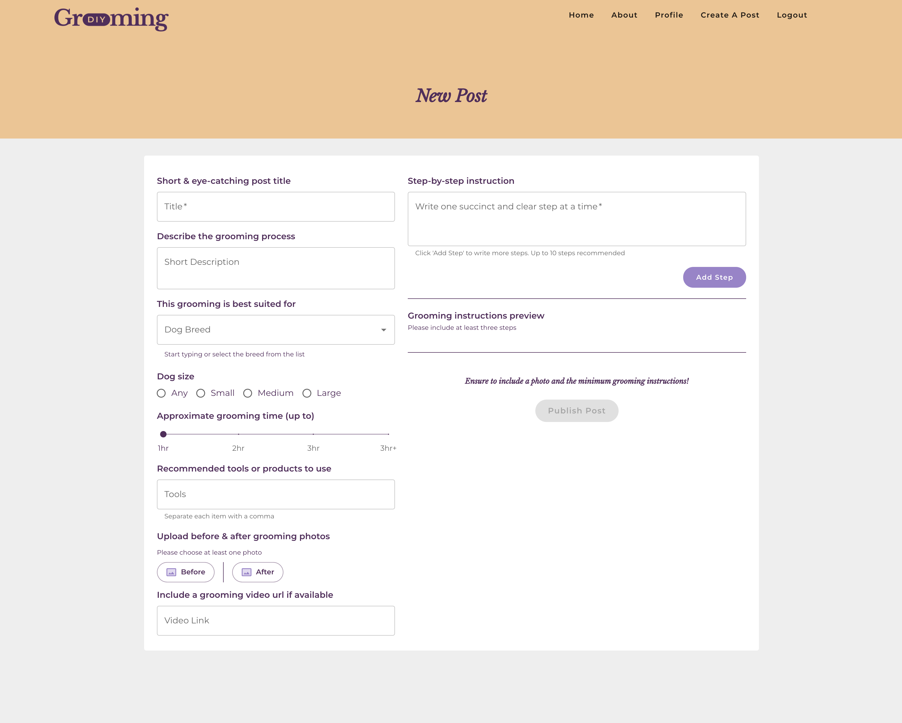
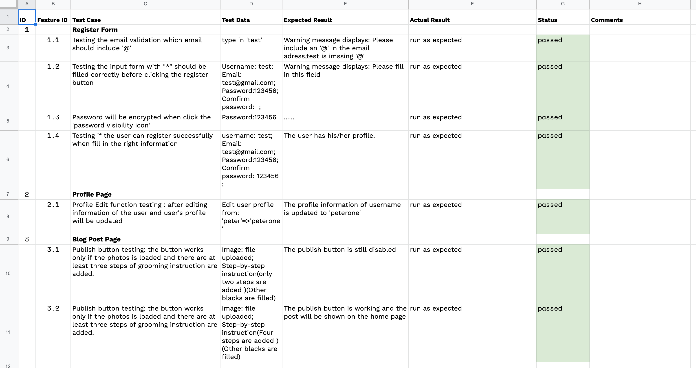

# DIY Grooming Blog – Client-Frontend

**T3A2-B MERN Full-stack App**

---

### Contributors

**The { W.A.N.T } Team:**

- Winny Chen → [GitHub](https://github.com/Winny1212)
- Angie Hentri → [GitHub](https://github.com/a-sh-dev)
- Natacha Bartu → [GitHub](https://github.com/NatachaBartu)
- Thang Za Thang → [GitHub](https://github.com/thangzathang)

---

# Deployed Website

```
https://diy-grooming.netlify.app/
```

👉🏻  [**Go to live website**](https://diy-grooming.netlify.app/) 


# Back-end github link

```
https://github.com/winny1212/server-backend
```

## User login for testing

- Email: catto@emailtest.com
- Password: 123123

## Screenshots

#### Home











# Backend – Server Side API

```
https://diy-grooming.herokuapp.com/
```

👉🏻  [**Go to live API**](https://diy-grooming.herokuapp.com/) 

# Documentations

👉🏻  [**Check documentations for project details**](https://github.com/DIYGrooming/docs)  


## System used

- Node v16.13
- Yarn 1.23 (client-front)
- NPM v8.1 (backend)
- Bootstrapped with Create React App

# Tech Stack

- **Frontend:**
  - React JS – for the UI front-end library
- **Styling:**
  - Material UI
  - Styled-components
  - CSS
- **Backend:**
  - Database – MongoDB to store user registrations data and posts data
- **Image Storage:**
  - Firebase – for storing users' post before and after grooming photos
- **Unit Testing:**
  - Jest – integration for unit testing
- **Deployment:**
  - Heroku for the backend API
  - Netlify for the frontend live website
- **Project Management & Collaborations Tools:**
  - Trello – managing tasks and sub-tasks
  - GitHub Organisation – to better manage the mini-repositories as a team
  - Discord – team communication tool
  - Google Docs

# Dependencies

- Jest & Supertest – unit testing
- Nodemon – better simultanously running the front and backend servers
- Firebase – for integrating Firebase storage implementation in the front-end
- Express – for server routing management & control
- Dotenv – offers security by automatically load environment variables in the development and production process
- Mongoose – used to integrate database library as Object Data Modelling to connect NodeJS with MongoDB
- React router dom – routing helper for React in creating dynamic routes and implementations


## Manual Testing

> [Google docs →](https://docs.google.com/spreadsheets/d/1mJl3-WuvjXtg10zq3uvOUODrX56ebJTQjuLsFqvPbC4/edit?usp=sharing)   




## Trello

Trello board link:

```
https://trello.com/b/lODYCsYA
```

